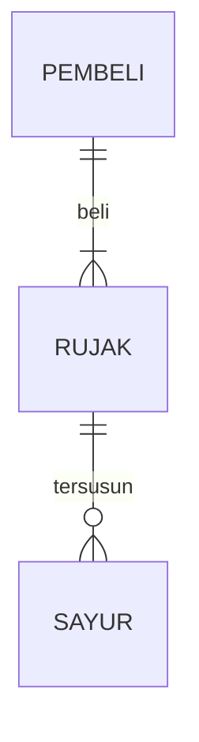

# game

## 1.1 Latar Belakang
Latar belakang saya membuat game ini adalah untuk memudahkan proses pembelajaran dan memotivasi anak anak untuk belajar al-qur'an atau iqro dengan cara yang menyenangkan

## 1.2. Deksripsi Teknologi Informasi
Game yang saya buat itu untuk membantu para anak anak dalam pembelajaran ilmu agama, di karenakan makin ke sini anak anak sudah jarang yang mau mengaji ke pengajian terdekat, makanya saya buat game yang berbasis teknologi informasi menggunakan java swing. nah, di dalam game ini saya memasukan huruf huruf hijaiyah dan suara dari masing masing huruf. di dalam gaame ini juga saya memasukkan karakter seorang anak kecil yang memakai pakaian komplit untuk mengaji,seperti peci,sarung,dan baju koko.untuk prosedur game ini kita bisa menebak huruf hijaiyah dan belajar untuk mengenalnya juga.

## 1.3. Branding
Merk : Game ngaji
Tagline : Belajar Al-Qur'an dengan seru dan menyenangkan!
campaign: Bergabunglah dalam petualangan menarik untuk menjelajahi keindahan al-qur'an melalui game mengaji!Dalam game ini kami mengundang anak-anak untuk merasakan pengalaman belajar al-qur'an yang menyenangkan,interaktif,dan penuh kegembiraan

## 2. User Story
-untuk usia 7+
-seorang yang ingin belajar dengan cara yang lebih efektif
tema:
-mudah
-menyenangkan
-sederhana

## 3. Struktur Data

Cara membuat aneka macam bentuk grafik menggunakan mermaid.js bisa lihat di [https://mermaid.js.org/syntax/entityRelationshipDiagram.html](https://mermaid.js.org/syntax/entityRelationshipDiagram.html) 

## 4. Arsitektur Sistem

Masih pake mermaid.js juga bisa lihat flowchart di [https://mermaid.js.org/syntax/flowchart.html](https://mermaid.js.org/syntax/flowchart.html)

## 5. Teknologi, Library, dan Framework

bla bla bla

## 6. Desain User Experience dan User Interface

Bisa load image 

## 7. Demonstrasi Video

Link youtube nya

## 8. Bagaimana mesin komputasi dan sistem operasi berperan dalam produk teknologi informasimu ?

Link youtube nya di detik jawaban ini

## 9. Bagaimana algoritma, struktur data, dan bahasa pemrograman berperan dalam produk teknologi informasimu ?

Link youtube nya di detik jawaban ini

## 10. Bagaimana metode pengembangan perangkat lunak / Software Development Life Cycle berperan dalam produk teknologi informasimu ?

Link youtube nya di detik jawaban ini

## 11. Bagaimana database / sistem basis data berperan dalam produk teknologi informasimu ?

Link youtube nya di detik jawaban ini
